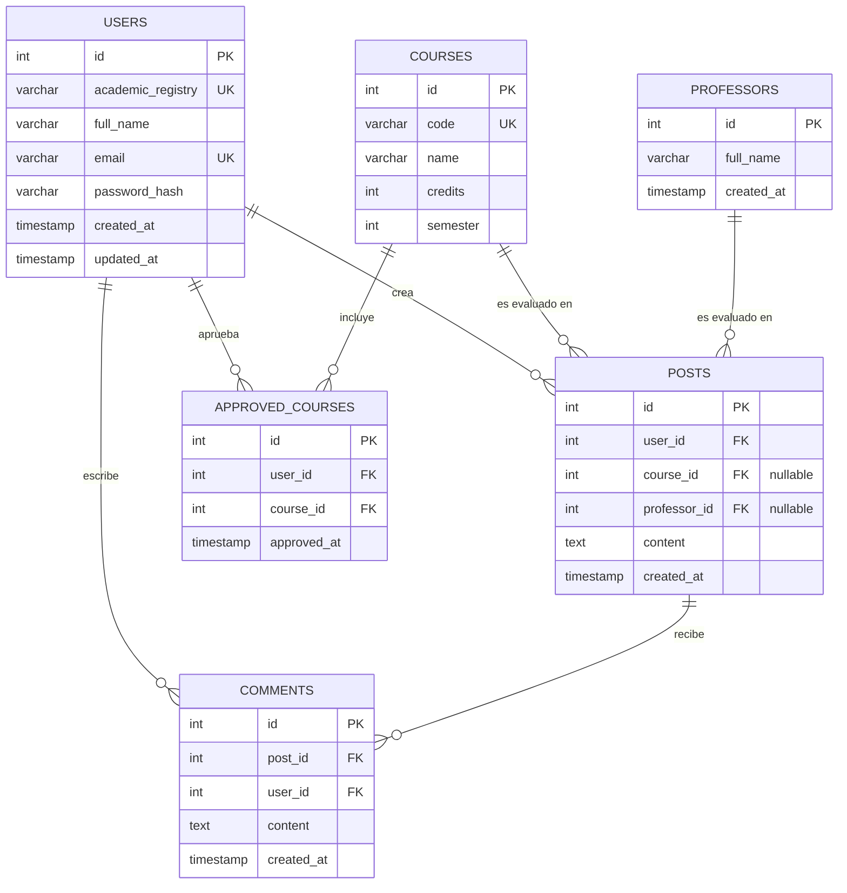
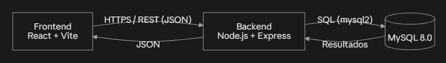

# Manual Técnico
## Sistema de Calificación de Cursos — Escuela de Ciencias y Sistemas, USAC

## 1. Integrantes

- [Rudin Alexander López Salvatierra] — [200919744]
- [Sergio Roberto Gudiel Sian] — [201404365]

## 2. Arquitectura general

Arquitectura Cliente-Servidor de tres capas:

```
┌────────────────────┐        HTTPS / REST (JSON)        ┌──────────────────────┐        SQL (mysql2)        ┌──────────────┐
│   Frontend (SPA)   │  ───────────────────────────────▶ │   Backend (API REST) │ ─────────────────────────▶│   MySQL 8.0  │
│  React 18+ / Vite  │ ◀───────────────────────────────  │  Node.js 20+/Express │ ◀─────────────────────────│              │
└────────────────────┘                                   └──────────────────────┘                            └──────────────┘
```

- **Frontend:** React (Vite), enrutamiento con `react-router-dom`, autenticación con JWT guardado en `localStorage` (claves `token` y `user`), consumo de la API mediante un helper `apiRequest` (`src/api/api.js`).
- **Backend:** Express, arquitectura en capas `routes → controllers → services/models`, autenticación con `jsonwebtoken` y contraseñas hasheadas con `bcryptjs`.
- **Base de datos:** MySQL 8.0, acceso mediante `mysql2/promise` con *connection pooling*.

## 3. Modelo Entidad-Relación



Reglas relevantes implementadas en `backend/src/database/database.sql`:
- `posts` exige que **exactamente uno** de `course_id` / `professor_id` esté presente.
- `approved_courses` tiene restricción única `(user_id, course_id)` para evitar duplicados.
- Eliminación en cascada (`ON DELETE CASCADE`) desde `posts`, `comments` y `approved_courses` hacia sus tablas padre.
- `courses.code` es único; por eso el catálogo se carga una sola vez desde `backend/src/seed.js` (revisa si ya existe antes de insertar).

## 4. Especificación de endpoints

Base URL: `http://localhost:3000/api` (configurable con `PORT` en `.env`).
Todos los endpoints marcados con 🔒 requieren el header `Authorization: Bearer <token>`.

### 4.1 Autenticación (`/auth`)

| Método | Ruta | Auth | Body | Descripción |
|---|---|---|---|---|
| POST | `/auth/register` | — | `{ academicRegistry, fullName, email, password }` | Registra un usuario nuevo |
| POST | `/auth/login` | — | `{ academicRegistry, password }` | Retorna `{ token, user }` |
| POST | `/auth/recover-password` | — | `{ academicRegistry, email, newPassword }` | Restablece la contraseña si carné y correo coinciden |
| GET | `/auth/me` | 🔒 | — | Devuelve el usuario autenticado |

### 4.2 Catálogos

| Método | Ruta | Auth | Descripción |
|---|---|---|---|
| GET | `/courses` | 🔒 | Lista los cursos del catálogo |
| GET | `/courses/:id` | 🔒 | Detalle de un curso |
| GET | `/professors` | 🔒 | Lista los catedráticos del catálogo |
| GET | `/professors/:id` | 🔒 | Detalle de un catedrático |

### 4.3 Publicaciones (`/posts`)

| Método | Ruta | Auth | Body / Query | Descripción |
|---|---|---|---|---|
| GET | `/posts?courseId=&professorId=&courseName=&professorName=` | 🔒 | — | Muro, ordenado por fecha descendente |
| GET | `/posts/:id` | 🔒 | — | Detalle de publicación con comentarios |
| POST | `/posts` | 🔒 | `{ content, courseId? , professorId? }` | Crea publicación (curso **o** catedrático) |
| GET | `/posts/:postId/comments` | 🔒 | — | Lista comentarios de una publicación |
| POST | `/posts/:postId/comments` | 🔒 | `{ content }` | Agrega un comentario |

### 4.4 Perfiles (`/profiles`)

| Método | Ruta | Auth | Body / Query | Descripción |
|---|---|---|---|---|
| GET | `/profiles/me` | 🔒 | — | Perfil propio |
| PUT | `/profiles/me` | 🔒 | `{ fullName, email }` | Edita perfil propio (no permite cambiar el carné). Responde `{ message, profile }` |
| GET | `/profiles/search?academicRegistry=` | 🔒 | — | Buscador de perfiles por carné |
| GET | `/profiles/:academicRegistry` | 🔒 | — | Perfil de un tercero (solo lectura) |
| GET | `/profiles/me/approved-courses` | 🔒 | — | Cursos aprobados propios + créditos totales |
| POST | `/profiles/me/approved-courses` | 🔒 | `{ courseId }` | Agrega curso aprobado al expediente propio |
| DELETE | `/profiles/me/approved-courses/:courseId` | 🔒 | — | Elimina curso aprobado del expediente propio |
| GET | `/profiles/:academicRegistry/approved-courses` | 🔒 | — | Cursos aprobados de un tercero (solo lectura) |

## 5. Rutas del frontend

| Ruta | Página | Protegida |
|---|---|---|
| `/login` | Inicio de sesión | No |
| `/register` | Registro de usuario | No |
| `/recover-password` | Recuperar contraseña | No |
| `/home` | Muro de publicaciones + filtros + crear publicación | Sí |
| `/posts/new` | Crear publicación | Sí |
| `/posts/:id` | Detalle de publicación + comentarios | Sí |
| `/profile` | Perfil propio (editable + cursos aprobados) | Sí |
| `/profile/:academicRegistry` | Perfil de un tercero (solo lectura) | Sí |

## 6. Variables de entorno

`backend/.env` (ver `.env.example`, nunca se sube el `.env` real):

```
DB_HOST=localhost
DB_USER=root
DB_PASSWORD=
DB_NAME=sistema_calificacion_cursos
DB_PORT=3306
PORT=3000
JWT_SECRET=cambia_esto_por_un_secreto_seguro
JWT_EXPIRES_IN=8h
```

`frontend/.env`:

```
VITE_API_URL=http://localhost:3000/api
```

## 7. Cómo levantar el proyecto desde cero

```bash
# Base de datos (crea las tablas vacías, NO ejecutar de nuevo si ya tienes datos)
mysql -u root -p < backend/src/database/database.sql

# Backend
cd backend
cp .env.example .env      # y edita DB_PASSWORD/JWT_SECRET
npm install
npm run seed               # carga usuarios de prueba + catálogo de cursos y catedráticos
npm run dev                 # http://localhost:3000

# Frontend
cd frontend
npm install
npm run dev                  # http://localhost:5173
```

## 8. Captura de arquitectura


