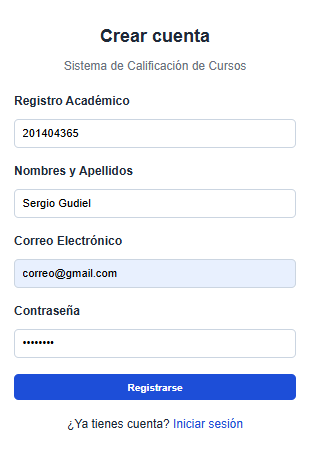
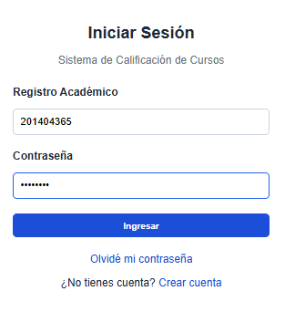
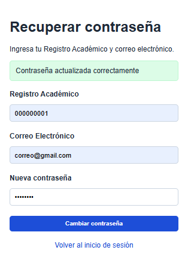
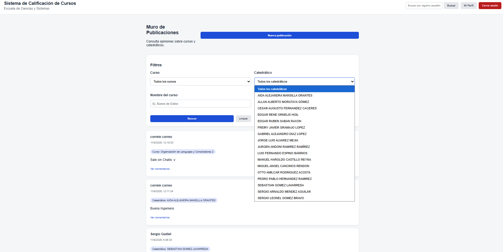
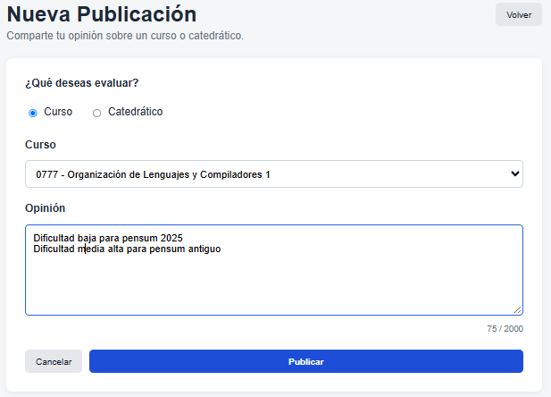
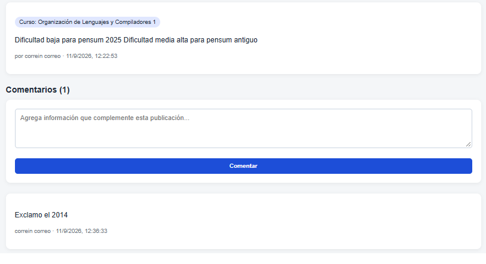
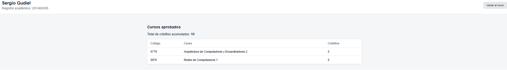
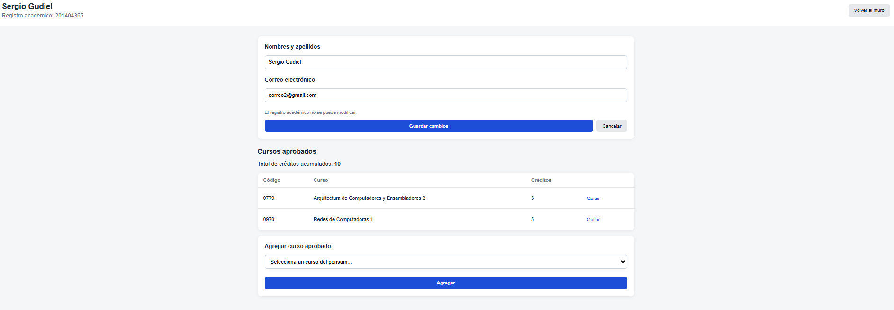
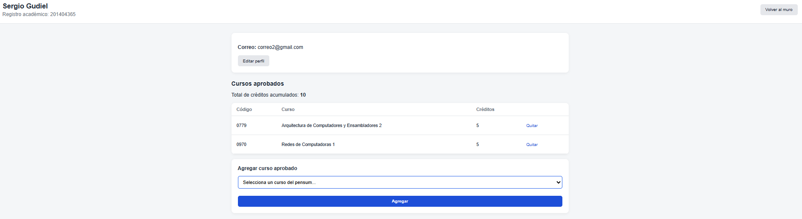
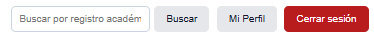

# Manual de Usuario
## Sistema de Calificación de Cursos — Escuela de Ciencias y Sistemas, USAC

## 1. ¿Qué es este sistema?

Una plataforma web para que los estudiantes de Ciencias y Sistemas consulten y compartan opiniones sobre cursos y catedráticos, en lugar de depender de grupos de Facebook no estructurados.

## 2. Crear una cuenta

1. En la pantalla de inicio de sesión, selecciona **Crear cuenta**.
2. Completa: registro académico (carné), nombres y apellidos, correo electrónico y contraseña.
3. Al finalizar, el sistema te redirige automáticamente a la pantalla de inicio de sesión.

## 3. Iniciar sesión

1. Ingresa tu registro académico y tu contraseña.
2. Solo usuarios registrados pueden acceder al resto de la plataforma.

## 4. Recuperar contraseña

1. Selecciona **Olvidé mi contraseña**.
2. Ingresa tu registro académico y tu correo electrónico, y la nueva contraseña que quieres usar.
3. Si tus datos coinciden con tu registro, el sistema actualiza la contraseña. Si no coinciden, muestra un mensaje de error.

## 5. Muro de publicaciones

Al iniciar sesión llegas a `/home`, con las publicaciones más recientes primero.

- **Filtrar** por curso, catedrático, o por texto en el nombre de curso/catedrático.
- **Buscar perfil** por registro académico desde la barra superior.
- **Nueva publicación:** elige si tu opinión es sobre un curso o un catedrático, selecciónalo de la lista y escribe tu comentario.
- Cada publicación muestra quién la escribió y cuándo.

## 6. Comentar una publicación

1. Desde el muro, selecciona **Ver comentarios** en cualquier publicación.
2. Escribe tu comentario y presiona **Comentar**. Necesitas sesión iniciada para comentar.

## 7. Buscar y ver perfiles

1. Usa el buscador en la parte superior del muro (por registro académico) para encontrar a otro estudiante.
2. Verás su nombre, carné y sus cursos aprobados con el total de créditos. Estos datos son de solo lectura si no es tu propio perfil.

## 8. Editar tu perfil

1. Entra a **Mi perfil**.
2. Selecciona **Editar perfil** para actualizar tu nombre o correo. El registro académico no puede modificarse.

## 9. Gestionar tus cursos aprobados

Desde tu propio perfil:

- **Agregar:** selecciona un curso del listado (basado en el pensum oficial) y presiona **Agregar**.
- **Quitar:** presiona **Quitar** junto al curso que deseas eliminar de tu expediente.
- El total de créditos acumulados se actualiza automáticamente.

## 10. Cerrar sesión

Presiona **Cerrar sesión** en la barra superior en cualquier momento.

---